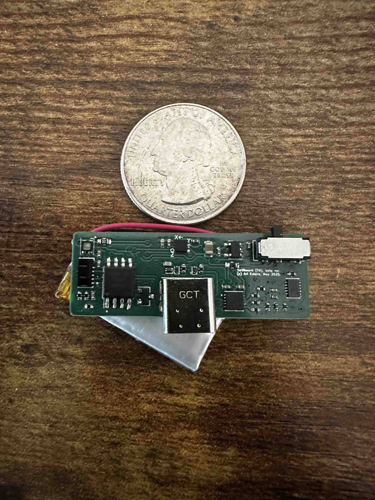
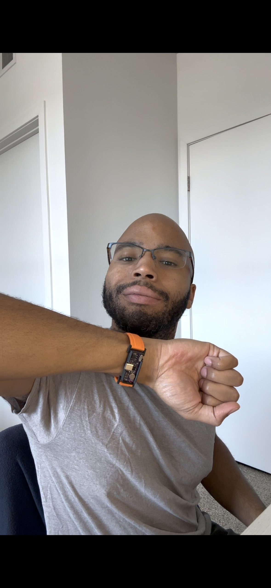
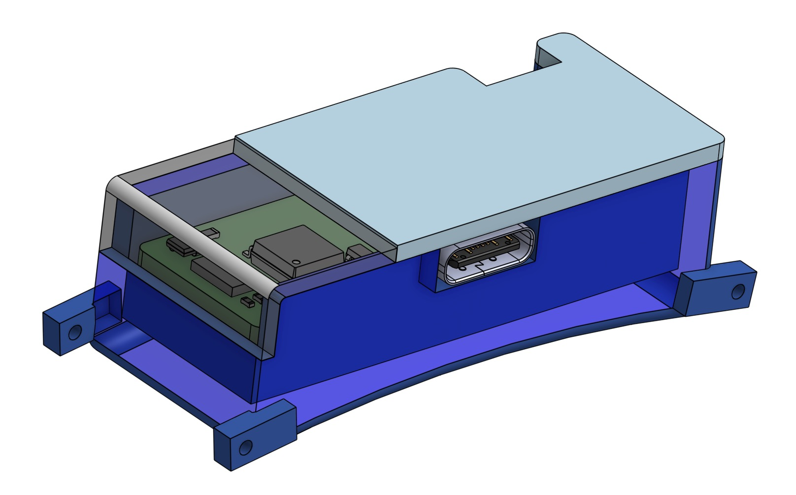

# dont-touch-your-face-wristband
A wristband that vibrates when the wearer tries to touch their face

## System overview
First of all, the device must be worn on the inside of the wrist, facing towards the body when one's arm is by their side. 

The wristband functions by using two sensors: an accelerometer to measure arm position, and an IR optical sensor to measure proximity. The workflow is described below.
- The microcontroller remains in Sleep mode to conserve power until the arm is raised.
- Once the arm is raised - which is determined by an accelerometer threshold - the accelerometer wakes the microcontroller (MCU) via pin interrupt.
- The MCU remains in Active mode while the arm is raised. In Active mode, the MCU continuously polls the proximity sensor.
- If the proximity reading surpasses a certain threshold, the MCU triggers the vibration motor to alert the wearer.

Note that an alert will not be sent to the wearer unless both the arm is raised (accelerometer threshold) and the hand is close to the face (proximity threshold). This increases the likelihood that the wearer receives a vibration alert only if their hand is near their neck face.

## Cover glass for proximity sensor
In the assembly, the proximity sensor is purposely placed near the edge of the board. At this position, the sensor can detect proximity both above and beside the PCB. If using a cover glass, the following conditions must be met for best performance:
1. The cover glass must be made of IR-transparent material
2. The proximity sensor threshold may need to be increased, as cover glass will reflect some IR back to the sensor 
3. The cover glass should be curved such that the proximity sensor is sensitive to detection both above and near the edge of the PCB (see example)

Note that this implementation for proximity sensing is **PATENT PENDING**.

## Enclosure
The enclosure has been designed to be 3D-printable using PLA and a 0.2 mm nozzle. The design is compatible with off-the-shelf 18 mm wrist straps (see link).

[Amazon link to wrist straps](https://www.amazon.com/dp/B0C1RQ1HML)

The enclosure consists of a "bottom" (which the PCB sits in) and a "lid" (which is glued to the "bottom" to cover the PCB). The enclosure was designed using Onshape. The STEP files are included in `enclosure/`, and the Onshape design file can be accessed at the link below.

[Link to Onshape CAD file](https://cad.onshape.com/documents/f453aeea43687b5a9c082ca3/w/8d4d5c0042ac79ddd7b31543/e/8a52f216663301647b5c429d?renderMode=0&uiState=697bc61246433338537cc1be)

## Electronics
The Kicad design files, Gerber files, component datasheets, and bill of materials (BOM) are included in `electronics/`. The BOM includes components that can be assembled onto the board by PCB manufacturers. Not included in the BOM are the lithium polymer battery and the vibration motor. Links for those are provided below.

### Battery
The battery used in the initial version is a lithium polymer battery with a capacity of 110 mAh and dimensions of 28mm x 12mm x 4mm. The battery leads must be soldered to pads on the PCB.

The link points to a battery from LiPol battery, product number LP401228. Note that this is a foreign provider, and foreign shipping can be expensive. *It might be possible to find a **more convenient** LiPo battery vendor that can provide batteries with similar dimensions.*

[LiPo battery link](https://www.lithium-polymer-battery.net/8mah-200mah-3-7v-lithium-polymer-battery/?_gl=1*131f0fd*_up*MQ..*_gs*MQ..&gclid=Cj0KCQiAp-zLBhDkARIsABcYc6uI_U1x1whldtsxuwOGvXzmkzbKdzTadPaN4wI3JUhvP9JeFW5L0iYaApc_EALw_wcB&gbraid=0AAAAApXvFRnggWyuhWJ-bcXAyFbujbzTa)

### Vibration motor
The motor used in the initial version is a brushed DC haptic motor from Vybronics. These can be purchased from Digikey. The motor leads must be soldered to pads on the PCB.

[Vibration motor link](https://www.digikey.com/en/products/detail/vybronics-inc/VCLP0820B004L/10285889)

## Firmware
The initial version uses an ATtiny85 microcontroller, and the firmware is written and compiled using the Arduino IDE with AtTinyCore board configuration. The Arduino file can be found in `firmware/`.

There are custom drivers for the IR proximity sensor and the battery gauge (present on board, but not yet used by firmware). These drivers are required by the MCU firmware to communicate with these components. These can be found in `firmware/libraries/` and must be included in the Arduino libraries path on the machine compiling the firmware (typical path is `~/Arduino/libraries`).

## Known issues
### No easy way to upload firmware
In-system programming (ISP) is not trivial for the ATtiny85 MCU due to the limited number of pins. The pins used for ISP are also used for I2C communication by the MCU. This is a limitation of the MCU itself, which is limited in its number of pins and features.

----- Potential solution -----

Implement BOTH of the following:
- Add series resistors (470 Ohms) on the PB0 and PB2 pins of the MCU.
- Add pads shorted to MCU Pins *VCC*, *GND*, *PB0*, *PB1*, *PB2*, and *PB5* to the board layout. These pads can be used in an ISP layout to re-program the MCU in place.

### IR proximity sensor VCNL4020 is at End-Of-Life
Vishay Semiconductor no longer sells the VCNL4020 sensor included in this design. However, the VCNL4030X1 is supported and is very similar, though it uses a different footprint.

----- Potential solution -----

Replace VCNL4020 sensor with VCNL4030X1 sensor. Replace the VCNL4020 part with the VCNL4030X1 part in the Kicad schematic and layout (symbol and footprint files already included). Create a driver for VCNL4030X1 using the VCNL4020 driver (in `firmware/libraries/`) as a starting point. 

### Unclear assembly directions for entire part 
The assembly instructions could be clearer, including the best order of operations (e.g., first cut wires to this length for battery and motor, then solder motor, then solder battery, etc...). I will try to expand on assembly instructions in the future. In the meantime, feel free to reach out to me with any questions.
